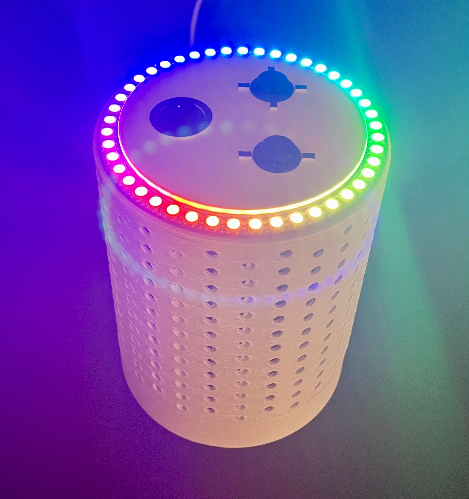
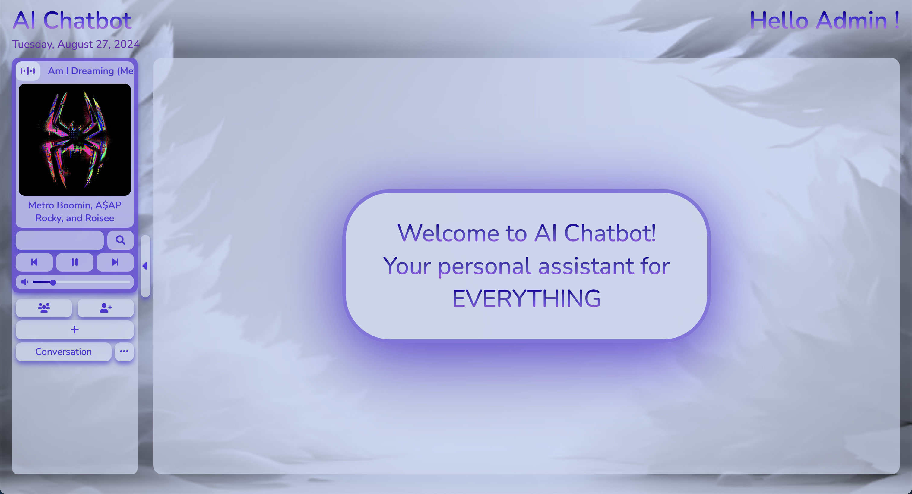
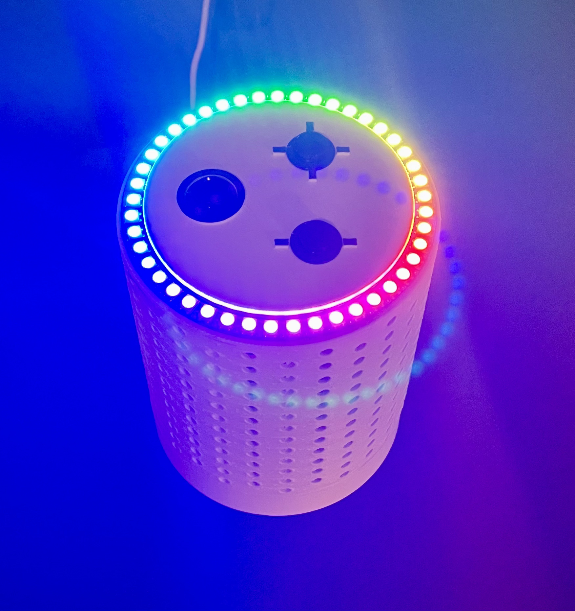
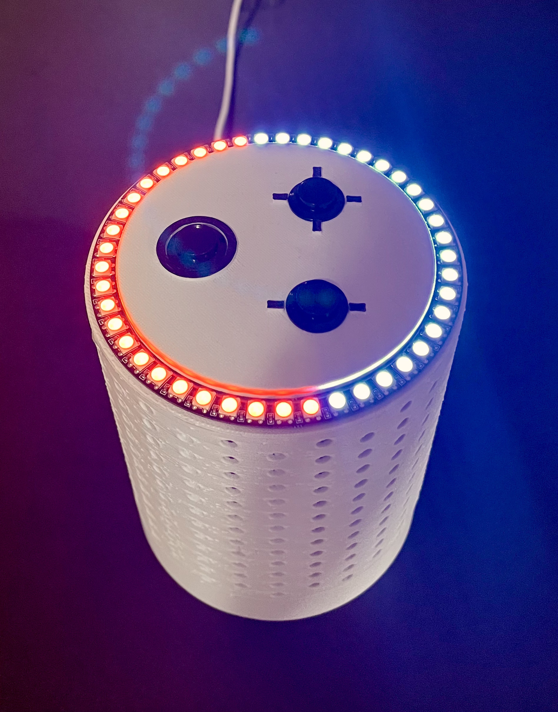
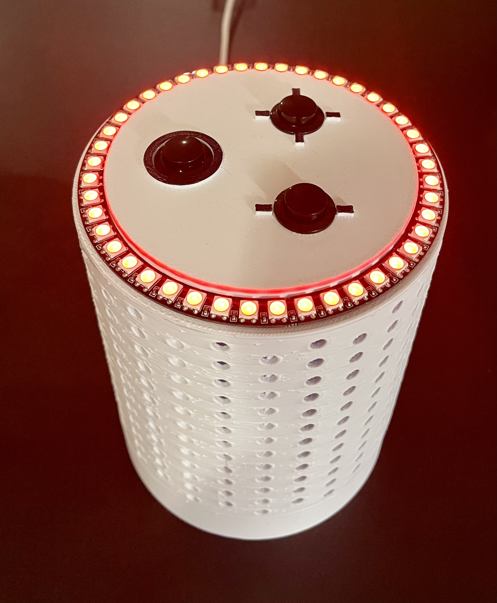

<h1 align="center">AI Chatbot</h1>

  

Voice assistant capable of responding to complex prompts and satisfying music requests received through speech or remotely accessible web interface. Includes features such as verbal, textual, and tactile input options to manipulate device settings (volume, sleep, reboot, shutdown), conversation flow (resetting memory, verbal response termination), and music playback (pause, resume, previous, next).

The web interface was based on the MERN tech stack and includes features such as secure user authentication and login using password encryption and JWT access tokens, special interface options for admins (activating user accounts, deleting users, music playback control, voice assistant volume manipulation, song search suggestions), creating multiple conversation threads, and full-screen conversation mode. Both the frontend and backend were hosted on ~~EC2 instances~~ the voice assistant itself (RPi), request routing was handled using Route 53, and access over HTTPS was enabled by Caddy.

## Requirements:
* Voice Assistant
  * RPi 4B
  * 3 tactile buttons
  * 1 WS2812 LED ring
  * Speaker HAT
  * Custom 3D printed case
* Web Interface
  * ~~2 EC2 instances (kept crashing with one due to limited specs with free tier)~~
    * Switched to hosting both frontend and backend on RPi for convenience
  * 1 Route 53 hosted zone (routes for frontend and backend EC2 instances)

## Demo:
* <a href="https://github.com/MattHua04/AI_Chatbot_Frontend">Frontend Repo</a>
* <a href="https://github.com/MattHua04/AI_Chatbot_Backend">Backend Repo</a>
* ~~Username: DEMO~~
* ~~Password: DEMO~~
* ~~Demo users can't edit their profile for obvious reasons, but you can still test out the conversation features~~
  * ~~Newly registered users need to be activated by an admin so outside testing is limited to the demo account~~

  <a href="https://ai-chatbot.hbypjt.com">
    <s>View Site</s>
  </a>

  Web interface no longer available, view the demo video below:

    

<h2 align="center">Listening for user prompt</h2>

  

<h2 align="center">Volume level visualization</h2>

  

<h2 align="center">Sleep mode</h2>

  

